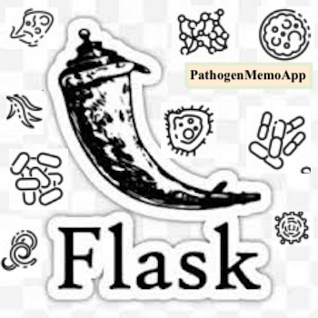

# PathogenMemoApp


[](https://opensource.org/licenses/MIT)
[](https://zenodo.org/badge/latestdoi/230990869)


* About:
	
	A Flask REST-API displaying some characteristics of serveral Pathogens/Potential Pathogens (demo).


* Some Tech/ Features used /tested

- Responsive table : Displaying data from database.
- REST-SWAGGER(OpenApi:3.0.0) : Rest-API module for somes entries.
- CRUD operations
- Restrict Access( Delete page and Dashboard, as a demo)
- SignUp / Login module. 
>> Login:hello@gmail.com // Pass: helloH9 , if you want to test the app.
- Responsive graphics (Matplotlib.)


### HowTo 
	* One container Strategy (Dev)
- You can build your own image for the application

```bash
docker build -t pathogen-memo-pack . 
```

- Then  Run the application with the cmd below:

```bash
docker run -it -p 8080:8080 -p 5432:5432 -p 5000:5000 pathogen-memo-pack:latest
```
- SignUp:
http://yourserver:5000/signup


	* Docker-compose Strategy (Dev)
```bash
docker-compose down -v
docker-compose -f docker-compose.yml up -d --build
```


### - Link: Demo (Production)
	* Demo (Production) : <a href="https://pathogen-memo.herokuapp.com"> https://pathogen-memo.herokuapp.com </a>
	* PyPackageTest : https://test.pypi.org/manage/project/pathogen-memo


##### - Author
Najlabioinfo

##### -  License
MIT
